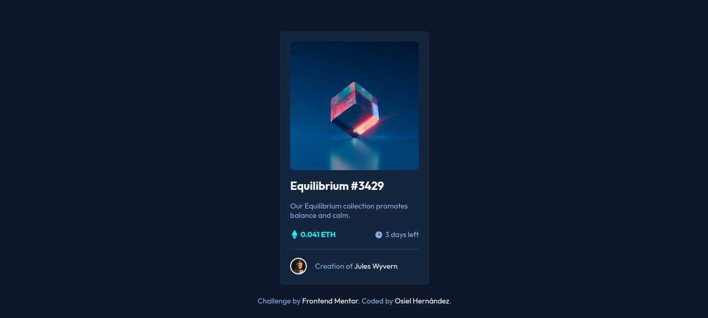

# Frontend Mentor - NFT preview card component solution

This is a solution to the [NFT preview card component challenge on Frontend Mentor](https://www.frontendmentor.io/challenges/nft-preview-card-component-SbdUL_w0U). Frontend Mentor challenges help you improve your coding skills by building realistic projects. 

## Table of contents

- [Overview](#overview)
  - [The challenge](#the-challenge)
  - [Screenshot](#screenshot)
  - [Links](#links)
- [My process](#my-process)
  - [Built with](#built-with)
  - [What I learned](#what-i-learned)
  - [Useful resources](#useful-resources)
- [Author](#author)

## Overview

### The challenge

Users should be able to:

- View the optimal layout depending on their device's screen size
- See hover states for interactive elements

### Screenshot



### Links

- Solution URL: https://github.com/xXOsielXx/nft-preview-card-component-challenge
- Live Site URL: https://xxosielxx.github.io/nft-preview-card-component-challenge

## My process

### Built with

- Semantic HTML5 markup
- CSS custom properties
- Flexbox
- Mobile-first workflow

### What I learned

In this project I used a layer above the main image to simulate that it changes its color. I apply a background color of cyan to it, and an opacity of 0.5, that way the image is still visible. Also, I used translate property with the view icon to center it.

```html
<div class="nft-preview-card-component__img-container">
    
    <div class="layer"></div>
    <i class="icon-view"></i>
</div>
```
```css
.nft-preview-card-component__img-container {
    position: relative;
    cursor: pointer;
}

.image {
	vertical-align: middle;
	z-index: 6;
}

.image,
.layer {
	width: 100%;
	border-radius: 8px;
}

.layer {
	height: 100%;
	top: 0;
	left: 0;
	background-color: var(--cyan);
	opacity: 0.5;
	z-index: 7;
}

.icon-view {
	background-image: url("images/icon-view.svg");
	top: 50%;
	left: 50%;
	width: 48px;
	height: 48px;
	translate: -50% -50%;
	z-index: 8;
}

.layer,
.icon-view {
	position: absolute;
	display: none;
}

.nft-preview-card-component__img-container:hover .layer {
	display: inline-block;
}

.nft-preview-card-component__img-container:hover .icon-view {
	display: inline-block;
}
```

### Useful resources

- [Perplexity](https://www.perplexity.ai/) - This is a great tool for online search purposes. Thanks to this AI I have been able to find the solution to my code problems very quickly.
- [Stackoverflow](https://stackoverflow.com/) - This is an excelent way to search for solutions. In this popular website I finded solutions to my code problems many times because I'm never the first to have a specific problem appear.

## Author

- Website - [Osiel Hernández](https://xxosielxx.github.io/osez-folio)
- LinkedIn - [Osiel Hernández](https://www.linkedin.com/in/osiel-hern%C3%A1ndez-rodr%C3%ADguez-9869612a1/)
- Github - [@xXOsielXx](https://github.com/xXOsielXx)
- Frontend Mentor - [@xXOsielXx](https://www.frontendmentor.io/profile/xXOsielXx)